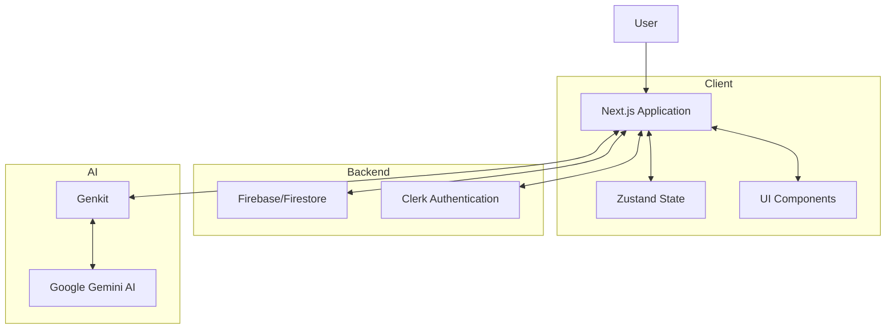
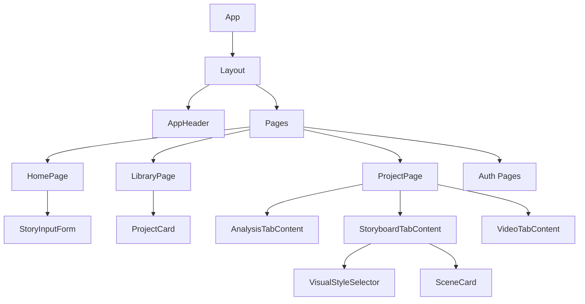
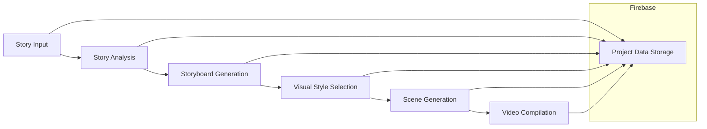
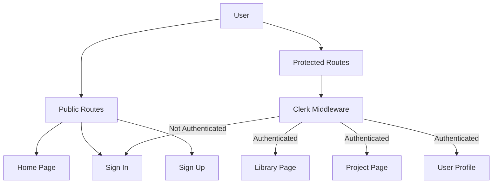
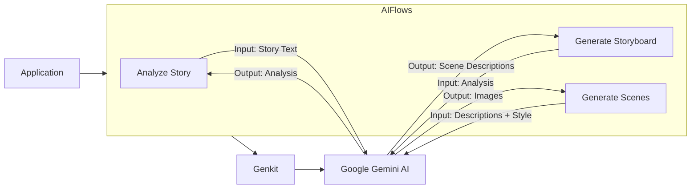
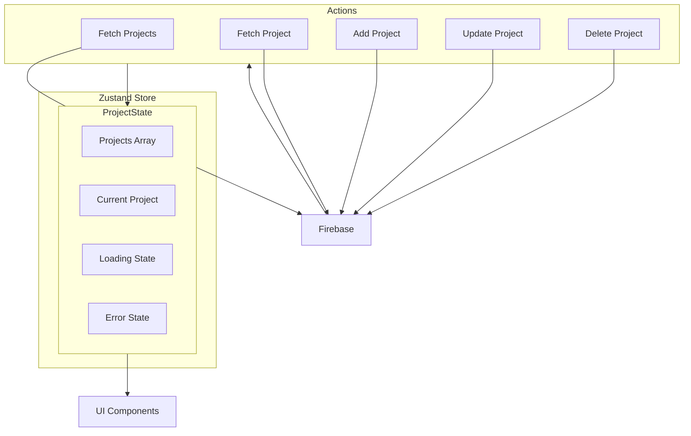
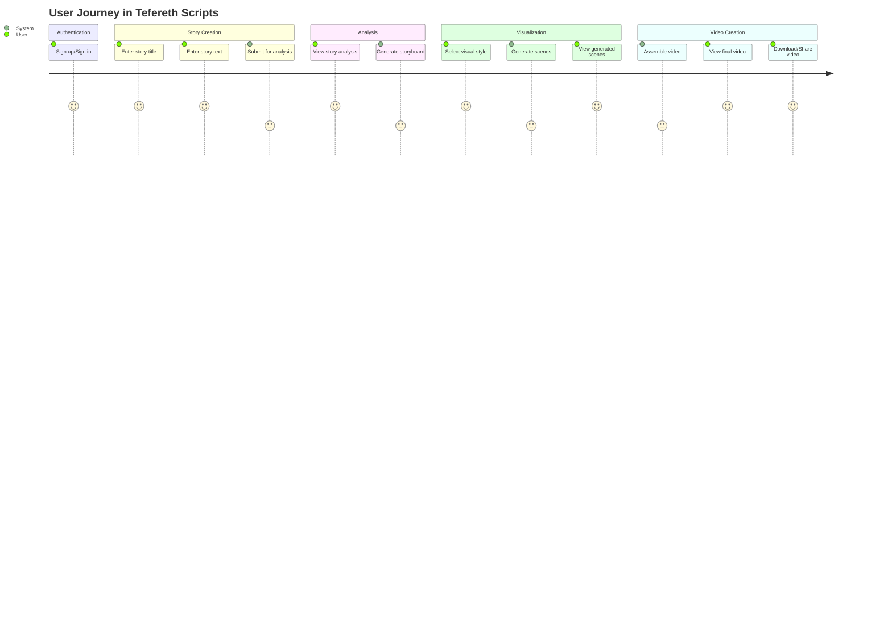

# Tefereth Scripts: Comprehensive Codebase Analysis

This document provides an in-depth analysis of the Tefereth Scripts codebase from multiple perspectives: software architect, software developer, and product manager. It aims to give a holistic understanding of the application's structure, implementation, and features.

## Table of Contents

1. [Introduction](#introduction)
2. [Software Architecture Perspective](#software-architecture-perspective)
3. [Software Developer Perspective](#software-developer-perspective)
4. [Product Manager Perspective](#product-manager-perspective)
5. [Conclusion](#conclusion)

## Introduction

Tefereth Scripts is a web application that transforms text stories into visual content and videos using AI. The application allows users to input a story, analyzes it using AI, generates a storyboard, creates visual scenes based on the storyboard, and finally compiles these scenes into a video.

### Key Features

- Story analysis using AI
- Storyboard generation
- Scene visualization with multiple visual style options
- Video compilation
- User authentication and project management
- Responsive design for various devices

### Technology Stack

- **Frontend**: Next.js with TypeScript
- **UI Components**: Radix UI with Tailwind CSS
- **State Management**: Zustand
- **Authentication**: Clerk
- **Backend/Database**: Firebase (Firestore)
- **AI Integration**: Genkit with Google's Gemini AI

## Software Architecture Perspective

### System Architecture Overview

The application follows a modern web architecture pattern with a Next.js frontend, Firebase backend, and AI services integration.



### Component Structure

The application is structured around several key components:



### Data Flow

The data flow in the application follows a clear path from story input to video creation:



### Authentication and Security

The application uses Clerk for authentication and implements middleware to protect routes:



### AI Integration Architecture

The AI integration is handled through Genkit, which connects to Google's Gemini AI:



### State Management Approach

The application uses Zustand for state management, with a primary focus on project data:



## Software Developer Perspective

### Code Organization and Project Structure

The codebase follows a well-organized structure typical of Next.js applications:

- `/src`: Main source code directory
  - `/app`: Next.js app router pages
  - `/components`: UI components
    - `/ui`: Base UI components
    - `/app`: Application-specific components
  - `/ai`: AI integration code
    - `/flows`: AI workflow definitions
  - `/lib`: Utility functions and types
  - `/stores`: Zustand stores
  - `/hooks`: Custom React hooks

### Key Components and Their Responsibilities

#### Pages

- `page.tsx` (Home): Entry point for creating new projects
- `library/page.tsx`: Displays all user projects
- `project/[projectId]/page.tsx`: Project details with tabs for different stages

#### AI Flows

- `analyze-story.ts`: Analyzes story text to extract themes, characters, structure, and summary
- `generate-storyboard.ts`: Creates scene descriptions based on story analysis
- `generate-scenes.ts`: Generates images for each scene description using the selected visual style

#### Components

- `StoryInputForm.tsx`: Form for inputting story title and text
- `ProjectCard.tsx`: Card displaying project information in the library
- `AnalysisTabContent.tsx`: Displays story analysis results
- `StoryboardTabContent.tsx`: Manages storyboard generation and scene creation
- `VideoTabContent.tsx`: Handles video compilation from generated scenes

### AI Integration Implementation

The AI integration is implemented using Genkit, which provides a structured way to define AI flows:

1. **Schema Definition**: Each AI flow defines input and output schemas using Zod
2. **Prompt Definition**: Prompts are defined with specific instructions for the AI
3. **Flow Implementation**: The flow connects the input, prompt, and output processing

Example from `analyze-story.ts`:

```typescript
const analyzeStoryPrompt = ai.definePrompt({
  name: 'analyzeStoryPrompt',
  input: {schema: AnalyzeStoryInputSchema},
  output: {schema: AnalyzeStoryOutputSchema},
  prompt: `You are a literary expert. Analyze the provided story and identify key themes, main characters, story structure, and provide a summary.

Story:
{{storyText}}`,
});

const analyzeStoryFlow = ai.defineFlow(
  {
    name: 'analyzeStoryFlow',
    inputSchema: AnalyzeStoryInputSchema,
    outputSchema: AnalyzeStoryOutputSchema,
  },
  async input => {
    const {output} = await analyzeStoryPrompt(input);
    return output!;
  }
);
```

### Firebase Integration

Firebase is used for data storage and retrieval:

1. **Configuration**: Firebase is initialized in `firebase-config.ts`
2. **Service Functions**: CRUD operations are defined in `firestore-service.ts`
3. **Data Model**: The project data structure is defined in `types.ts`

The application uses Firestore for storing project data, with a collection for projects and documents for each project.

### UI Component Library

The application uses a combination of Radix UI primitives and custom components styled with Tailwind CSS:

1. **Base Components**: Button, Card, Dialog, etc. from Radix UI
2. **Custom Components**: ProjectCard, SceneCard, etc. built on top of base components
3. **Styling**: Tailwind CSS for responsive design and theming

### Reusable Patterns and Utilities

Several reusable patterns are employed throughout the codebase:

1. **Custom Hooks**: `use-toast.ts`, `use-theme.ts`, etc.
2. **Type Definitions**: Comprehensive type definitions in `types.ts`
3. **Utility Functions**: Helper functions in `utils.ts`
4. **Error Handling**: Consistent error handling patterns in API calls and AI interactions

### Development Workflow

The development workflow is supported by several scripts in `package.json`:

- `dev`: Runs the Next.js development server
- `genkit:dev`: Starts the Genkit development server
- `build`: Builds the production application
- `typecheck`: Runs TypeScript type checking

## Product Manager Perspective

### User Journey

The user journey through the application follows a clear path:



### Feature Breakdown

The application offers several key features:

1. **Story Analysis**
   - AI-powered analysis of themes, characters, structure, and summary
   - Visual presentation of analysis results

2. **Storyboard Generation**
   - AI-generated scene descriptions based on story analysis
   - Editable scene descriptions
   - Drag-and-drop reordering

3. **Visual Style Selection**
   - Multiple visual styles to choose from (cinematic, anime, pixel art, etc.)
   - Preview images for each style

4. **Scene Generation**
   - AI-generated images for each scene based on the selected style
   - Regeneration of individual scenes
   - Editable scene descriptions

5. **Video Compilation**
   - Assembly of scenes into a video
   - Video preview
   - Download and sharing options

6. **Project Management**
   - Library of all user projects
   - Project status indicators
   - Search functionality

### User Experience Considerations

The application incorporates several UX considerations:

1. **Progressive Disclosure**
   - Tabs are enabled progressively as the user completes each step
   - Clear guidance on the next steps

2. **Visual Feedback**
   - Loading indicators for AI operations
   - Status badges for project progress
   - Toast notifications for actions

3. **Error Handling**
   - Friendly error messages for AI limitations
   - Validation for inputs
   - Recovery options for failed operations

4. **Responsive Design**
   - Mobile-friendly layout
   - Adaptive components for different screen sizes

### Potential Future Enhancements

Based on the current implementation, several potential enhancements could be considered:

1. **Advanced Video Editing**
   - Transitions between scenes
   - Background music selection
   - Text overlays and captions

2. **Collaboration Features**
   - Sharing projects with other users
   - Collaborative editing
   - Comments and feedback

3. **Enhanced AI Capabilities**
   - Character design customization
   - Scene style consistency
   - Voice narration generation

4. **Export Options**
   - Multiple video formats and resolutions
   - Social media integration
   - Embedding options

5. **Analytics and Insights**
   - Usage statistics
   - Popular styles and themes
   - Performance metrics

### Market Positioning

Tefereth Scripts positions itself as an AI-powered creative tool for storytellers, with several unique selling points:

1. **Accessibility**: Makes video production accessible to non-technical users
2. **Speed**: Rapid transformation from text to video
3. **Creativity**: Multiple visual styles and customization options
4. **Integration**: Seamless flow from story to final video

## Conclusion

### Summary of Findings

Tefereth Scripts is a well-designed application that effectively leverages modern web technologies and AI capabilities to provide a streamlined experience for transforming text stories into visual content and videos. The application follows a clear workflow from story input to video creation, with a focus on user experience and progressive disclosure of features.

### Strengths of the Codebase

1. **Well-Structured Architecture**: Clear separation of concerns and modular components
2. **Type Safety**: Comprehensive TypeScript types throughout the codebase
3. **AI Integration**: Effective use of Genkit for AI flows
4. **User Experience**: Thoughtful UX design with progressive disclosure and visual feedback
5. **State Management**: Clean implementation of Zustand for state management
6. **Component Design**: Reusable and composable UI components

### Areas for Improvement

1. **Error Handling**: While error handling exists, it could be more comprehensive
2. **Testing**: No evidence of automated tests in the codebase
3. **Documentation**: Limited inline documentation for complex functions
4. **Performance Optimization**: No explicit performance optimizations for large projects
5. **Accessibility**: Limited focus on accessibility features

### Final Thoughts

Tefereth Scripts demonstrates a well-implemented modern web application that effectively integrates AI capabilities to provide a valuable service for storytellers. The codebase follows best practices in terms of architecture, state management, and component design, making it maintainable and extensible for future enhancements.

The application successfully bridges the gap between text-based storytelling and visual media production, providing an accessible tool for creators without technical expertise in video production. With its clear workflow and thoughtful UX design, Tefereth Scripts has the potential to become a valuable tool for content creators, educators, and storytellers.