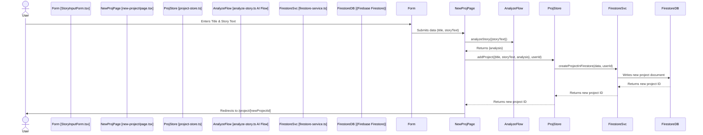
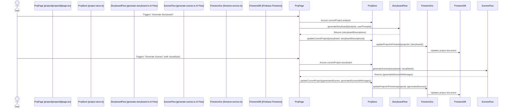

```markdown
# StorySpark: AI Video Producer - Codebase Analysis

**Date:** July 27, 2024

**Version:** 1.0

## 1. Introduction

This document provides an extensive analysis of the StorySpark codebase, an AI-powered application designed to transform written narratives into visual content. The analysis is presented from three key perspectives: Product Manager, Software Developer, and Software Architect, to offer a holistic understanding of the system.

## 2. Product Management Perspective

### 2.1. Product Purpose & Target Audience

*   **Purpose:** StorySpark aims to empower users to effortlessly transform their written narratives (stories, scripts, ideas) into engaging visual content, specifically short videos or animated storyboards. It democratizes basic video production by leveraging AI to handle complex tasks like story analysis, scene breakdown, and visual asset generation.
*   **Target Audience:**
    *   **Content Creators:** YouTubers, social media influencers, bloggers.
    *   **Writers & Storytellers:** Authors, screenwriters, hobbyists.
    *   **Educators & Trainers:** For simple animated explanations.
    *   **Marketers (Small Scale):** SMBs needing quick promotional visuals.
    *   **Hobbyists & Creative Individuals:** Anyone with a story to tell visually.

### 2.2. Key Features & User Stories (Current & Planned)

The application's features are derived from `docs/blueprint.md` and observed functionality:

1.  **Instant Story Analysis:**
    *   AI reads and understands narratives, identifying themes, characters, and structure.
    *   *User Story:* "As a user, I want the AI to analyze my story so I can understand its interpretation before visual generation."
2.  **AI-Powered Storyboarding:**
    *   AI generates a visual storyboard (textual descriptions of scenes) from the analyzed story.
    *   *User Story:* "As a user, I want the AI to break my story into key scenes so I have a plan for my video."
3.  **Custom Visual Styles (Partially Implemented/Planned):**
    *   Users can select pre-designed visual styles. The `generateScenes` flow accepts a `visualStyle` parameter.
    *   *User Story:* "As a user, I want to choose a visual style so my video matches my desired aesthetic."
4.  **Intelligent Scene Generation (Image Generation):**
    *   AI generates unique images for each storyboard scene based on its description and chosen style.
    *   *User Story:* "As a user, I want AI to create images for my scenes so I don't have to source them myself."
5.  **Automated Video Assembly (Planned/Future):**
    *   The application aims to automatically edit and combine generated scenes (currently images) into a final video.
    *   *User Story:* "As a user, I want the app to combine my scenes into a video automatically."
6.  **Project Library & Management:**
    *   Users can save and manage their projects (story, analysis, scenes).
    *   *User Story:* "As a user, I want to save my projects so I can access and work on them later."
7.  **One-Tap Sharing (Planned/Future):**
    *   Export finished videos optimized for social media.
    *   *User Story:* "As a user, I want to easily export my video for social media sharing."

### 2.3. Value Proposition

*   **Speed & Efficiency:** Reduces time and effort for visual story creation.
*   **Accessibility:** Makes video/storyboard creation accessible to non-technical users.
*   **Cost-Effectiveness:** Cheaper alternative to manual illustration/editing for simple projects.
*   **Creativity Boost:** Helps visualize ideas quickly.
*   **Engagement:** Enhances textual content with visuals.

### 2.4. Potential Monetization Strategies (Speculative)

*   **Freemium Model:** Free tier with limitations (projects, styles, watermarks), paid tiers for more features and higher limits.
*   **AI Credits:** Pay-per-use for AI processing tasks.

### 2.5. Potential Challenges & Risks

*   **AI Quality & Consistency:** Ensuring high-quality, relevant AI output.
*   **User Expectations Management:** Aligning user expectations with current AI capabilities.
*   **Cost of AI APIs:** Balancing API costs with pricing.
*   **Content Safety & Moderation:** Handling inappropriate AI generations.
*   **Market Differentiation:** Standing out in a growing AI content generation market.

## 3. Software Developer Perspective

### 3.1. Code Structure, Modularity, and Reusability

*   **Frontend (Next.js/React):**
    *   Standard Next.js app router structure (`src/app/`).
    *   Shadcn/ui components (`src/components/ui/`) ensure UI consistency.
    *   App-specific components (`src/components/app/`) are reasonably modular.
    *   AI flow calls and Firebase interactions are well-abstracted from UI logic.
    *   Centralized project state management with Zustand (`src/stores/project-store.ts`).
*   **Backend (AI Flows/Firebase):**
    *   AI tasks are modularized into Genkit flows (`src/ai/flows/`).
    *   Zod schemas enforce clear data contracts for AI flows.
    *   Firebase interactions are encapsulated in `src/lib/firestore-service.ts`.
    *   Configuration is centralized (`src/lib/firebase-config.ts`, `src/ai/genkit.ts`).

### 3.2. Design Patterns and Best Practices

*   **MVC/MVVM-like Frontend:** Clear separation of concerns.
*   **Service Layer:** `firestore-service.ts` and AI flows abstract business logic.
*   **Centralized State Management (Zustand):** With optimistic updates for better UX.
*   **Asynchronous Operations:** Consistent use of `async/await`.
*   **Error Handling:** Present in UI (toasts, specific messages for AI errors like quota/safety) and within some AI flows.
*   **Type Safety (TypeScript & Zod):** Enhances code quality and maintainability.
*   **Styling (TailwindCSS & Shadcn/ui):** For rapid and consistent UI development.
*   **Authentication (Clerk):** Securely offloaded to a third-party service.

### 3.3. Code Readability and Maintainability

*   **Readability:** Generally good, well-formatted, descriptive naming.
*   **Maintainability:** Aided by modular structure, TypeScript, Zod, and use of established libraries. `docs/blueprint.md` supports understanding.

### 3.4. Testing

*   **Current State:** No explicit unit, integration, or E2E test files were observed in the codebase.
*   **Recommendation:** This is a critical area for improvement. Tests are needed for AI flows (mocking AI responses), Firestore service, Zustand store logic, and React components.
*   `tsc --noEmit` script in `package.json` provides static type checking.

### 3.5. Key Dependencies

*   **Next.js:** Full-stack React framework.
*   **React:** Frontend library.
*   **TypeScript:** Static typing.
*   **TailwindCSS:** Utility-first CSS framework.
*   **Shadcn/ui:** UI component library.
*   **Zustand:** Client-side state management.
*   **Genkit & @genkit-ai/googleai:** AI framework and Google AI plugin.
*   **Firebase (firebase, @firebase/firestore):** Database and backend services.
*   **Clerk (@clerk/nextjs):** Authentication.
*   **Zod:** Schema validation.
*   **Lucide-react:** Icons.

### 3.6. Potential Areas for Developer Improvement

*   **Automated Testing:** Highest priority.
*   **Environment Variable Management:** Ensure all secrets (especially Firebase API key currently in `firebase-config.ts`) are sourced from environment variables.
*   **Comprehensive Error Logging:** Enhance server-side logging for easier debugging.
*   **Code Comments:** Add JSDoc and comments for complex or non-obvious logic.

## 4. Software Architect Perspective

### 4.1. System Design & Architecture

The system employs a modern web architecture:

*   **Client-Side:** Next.js (React) SPA.
*   **Server-Side (Next.js):** BFF pattern, handling API requests and orchestrating calls to AI flows and database.
*   **AI Processing:** Genkit flows interacting with Google AI services (Gemini models). This is a microservice-like approach for AI tasks.
*   **Database:** Firebase Firestore (NoSQL, cloud-hosted).
*   **Authentication:** Clerk (third-party).
*   **Deployment:** Firebase App Hosting.

```mermaid
graph TD
    subgraph User Device
        Frontend[Next.js Frontend - React UI]
    end

    subgraph Cloud Platform (Firebase/Google Cloud)
        NextServer[Next.js Backend Logic / API]
        subgraph AI_Services [AI Services]
            GenkitFlows[Genkit Flows - src/ai/flows]
            GoogleAI[Google AI Models - Gemini]
        end
        FirestoreDB[Firebase Firestore - Projects Data]
        ClerkAuth[Clerk Authentication Service]
        AppHosting[Firebase App Hosting]
    end

    Frontend -- HTTPS --> NextServer
    NextServer -- Invokes --> GenkitFlows
    GenkitFlows -- API Call --> GoogleAI
    NextServer -- CRUD --> FirestoreDB
    Frontend -- Auth Flow --> ClerkAuth
    NextServer -- Validates Token --> ClerkAuth
    AppHosting -- Serves --> Frontend
    AppHosting -- Runs --> NextServer
```

### 4.2. Data Flow Diagrams

#### 4.2.1. New Project Creation & Story Analysis



#### 4.2.2. Storyboard & Scene Image Generation (Conceptual)

This flow occurs on the `/project/[projectId]` page.



### 4.3. Scalability

*   **Frontend (Next.js on Firebase App Hosting):** Scales well. `maxInstances: 1` in `apphosting.yaml` is a current bottleneck for backend instance scaling and should be increased for production.
*   **AI Processing (Genkit/Google AI):** Google AI is scalable. Genkit flows' scalability depends on their deployment (e.g., serverless functions ideal). AI API quotas/costs are key considerations.
*   **Database (Firestore):** Highly scalable.
*   **Authentication (Clerk):** Scalable third-party service.

### 4.4. Maintainability

*   **Pros:** Good modularity, use of TypeScript & Zod, well-known technologies.
*   **Cons:** Lack of automated tests significantly impacts long-term maintainability.

### 4.5. Security

*   **Authentication:** Robust via Clerk. `middleware.ts` protects routes.
*   **Authorization:** Project access correctly tied to `userId` in Firestore queries and server-side checks.
*   **Input Validation:** Client-side (Zod in forms) and server-side (Zod in Genkit flows) is good. Character limits help prevent abuse.
*   **Secrets Management:** Firebase API key hardcoded in `firebase-config.ts` is a **critical vulnerability** and must be moved to environment variables.
*   **Content Safety:** AI safety filter errors are handled.
*   **Image Whitelisting:** `next.config.ts` correctly whitelists image CDNs.

### 4.6. Reliability & Resilience

*   **Cloud Services:** Firebase and Google AI are generally reliable.
*   **Error Handling:** Decent in UI and some AI flows.
*   **Single Point of Failure:** `maxInstances: 1` for Next.js backend in `apphosting.yaml` needs adjustment for production.
*   **Resilience to AI Service Issues:** Consider retry mechanisms or graceful degradation for AI service temporary unavailability.

### 4.7. Data Model (Firestore `projects` collection)

*   **Fields:** `id`, `userId`, `title`, `storyText`, `analysis` (object), `storyboard` (array of strings - inferred), `generatedScenes` (array of objects: `{ sceneDescription, imageUrl }`), `createdAt`, `updatedAt`.
*   **Structure:** Denormalized, good for read performance.
*   **Indexing:** `userId` and `createdAt` are used for queries; ensure Firestore indexes support these efficiently.

### 4.8. Architectural Recommendations

1.  **High Priority - Secrets Management:** Immediately move the Firebase API key and any other sensitive keys from code to secure environment variables.
2.  **High Priority - Testing:** Implement a comprehensive automated testing strategy (unit, integration, E2E).
3.  **Scalability Adjustments:** Increase `maxInstances` in `apphosting.yaml` for production.
4.  **Genkit Production Deployment:** Define and implement a robust production deployment strategy for Genkit flows (e.g., dedicated Cloud Functions if not handled by App Hosting).
5.  **Background Jobs for Long AI Tasks:** For future features like video rendering, use background job queues (e.g., Cloud Tasks) to avoid HTTP timeouts.
6.  **Cost Management & Observability:** Implement monitoring and alerting for API usage/costs and system health.
7.  **Video Processing Pipeline (Future):** Plan architecture for complex video processing if this feature is pursued.

## 5. Conclusion

StorySpark is built on a modern, largely scalable tech stack with a good separation of concerns. The integration of Genkit for AI flows and Firebase for backend services provides a solid foundation.

**Key Strengths:**
*   Clear product vision with useful AI-driven features.
*   Modular code structure.
*   Use of TypeScript and Zod for robustness.
*   Leverages scalable cloud services.

**Key Areas for Immediate Attention:**
1.  **Security:** Rectify secrets management (Firebase API key).
2.  **Testing:** Introduce a comprehensive automated testing suite.

Addressing these areas will significantly enhance the project's security, reliability, and long-term maintainability, paving the way for successful future development and scaling.
```
